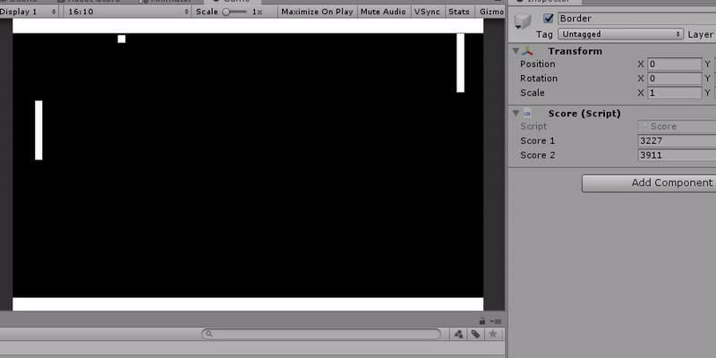

# Pong-Policy-gradients

Policy gradients is a reinforcement learning tecnique that trains a predictive model using the experiences of the agent.

### This project is still under development and is highly experimental



## TO DO
- Generalization of the concepts
- Cleaner API
- Refactor

## WHY (MOTIVATION)
[](https://www.youtube.com/watch?v=HRYYxJd9qiA) <br/>
This project was made by <b>Hector Pulido</b> for his youtube channel <br/>
https://www.youtube.com/c/HectorAndresPulidoPalmar <br/>
[And his Twitch Channel](https://www.twitch.tv/hector_pulido_)
<br/>


## How it works

This is the Policy function, it works like the brain, connect the state of the world with some weights. Then convert that enviorimental space to a probability space of actions

```csharp
Matrix Policy(Matrix state)
{
    var z = state * w;
    var exp = Matrix.Exp(z);
    exp = exp / Matrix.Sumatory(exp)[0,0];
    return exp;
}
```

The algoritm learn just like this:

This is the gradient function of the policy, it tell us in which direction the policy must move to improve the performance

```csharp
Matrix GradientSoftmax(Matrix softmax)
{
    Matrix shape = softmax.T;
    Matrix diagoFlat = Matrix.DiagFlat(shape);
    diagoFlat = diagoFlat - shape * shape.T;
    return diagoFlat;
}
```

that function is used like this

```csharp
var dsoftmax = GradientSoftmax(action);
dsoftmax = dsoftmax.Slice(index,0,index+1,dsoftmax.X);
dsoftmax = dsoftmax / action[0, index];
var grad = envi.T * dsoftmax;
```

then the weights get updated
``` csharp
void Train(double reward)
{
    for(int i = 0 ; i < gradHistory.Count; i++)
    {
        var update = gradHistory[i] * (learningRate * 
            decayRatio(i, reward));

        w += update;
    }
    gradHistory = new List<Matrix>();
}
``` 


## SIMILAR WORKS 
### IMITATION LEARNING IN UNITY
This is an open source project that uses neural networks and backpropagation in C#, and train it via stochastic gradient descend using the human behaviour as base <br/>
https://github.com/HectorPulido/Imitation-learning-in-unity
### Evolutionary Neural Networks on Unity For bots
This is a asset that train a neural networks using genetic algorithm in unity to make a bot that can play a game or just interact with the envoriment <br/>
https://github.com/HectorPulido/Evolutionary-Neural-Networks-on-unity-for-bots
### More Genetic algorithms on Unity
Those are three Genetics Algorithm using unity, The First one is a simple algorithm that Looks for the minimun of a function, The Second one is a solution for the Travelling Salesman Problem, The Third one is a Automata machine <br/>
https://github.com/HectorPulido/Three-Genetics-Algorithm-Using-Unity
### Vectorized Multilayer Neural Network from scratch
This is a simple MultiLayer perceptron made with Simple Linear Algebra for C# , is a neural network based on This Algorithm but generalized. This neural network can calcule logic doors like Xor Xnor And Or via Stochastic gradient descent backpropagation with Sigmoid as Activation function, but can be used to more complex problems. <br/>
https://github.com/HectorPulido/Vectorized-multilayer-neural-network

## Where can i learn more
- On my Youtube channel (spanish) are a lot of information about Machine learning and Neural networks
- https://www.youtube.com/channel/UCS_iMeH0P0nsIDPvBaJckOw
- This convolutional neural network (Pretty hardcore)
- https://github.com/HectorPulido/Convolutional-Neural-Network-From-Scratch
- This example of Genetics Algorithm on unity
- https://github.com/HectorPulido/Three-Genetics-Algorithm-Using-Unity
- You can also look at the Multilayer perceptron 
- https://github.com/HectorPulido/Vectorized-multilayer-neural-network
- Or The monolayer Example (Simpler)
- https://github.com/HectorPulido/Simple-vectorized-mono-layer-perceptron
- Or Look at a Non Vectorized multilayer perceptronExample
- https://github.com/HectorPulido/Multi-layer-perceptron

## LICENCE
This project contains a copy of:
* Simple linear algebra https://github.com/HectorPulido/Simple_Linear_Algebra

Everything else is MIT licensed